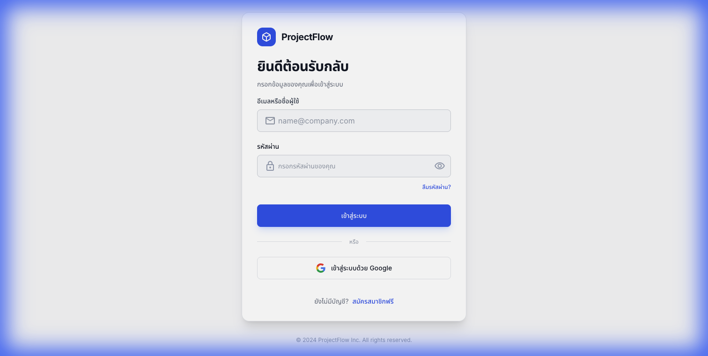
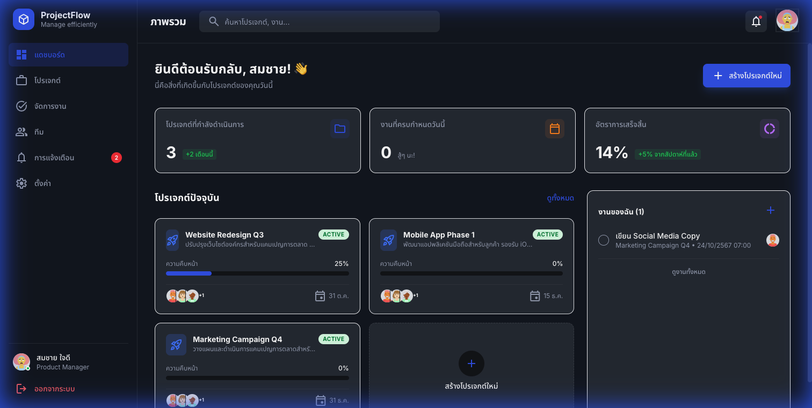
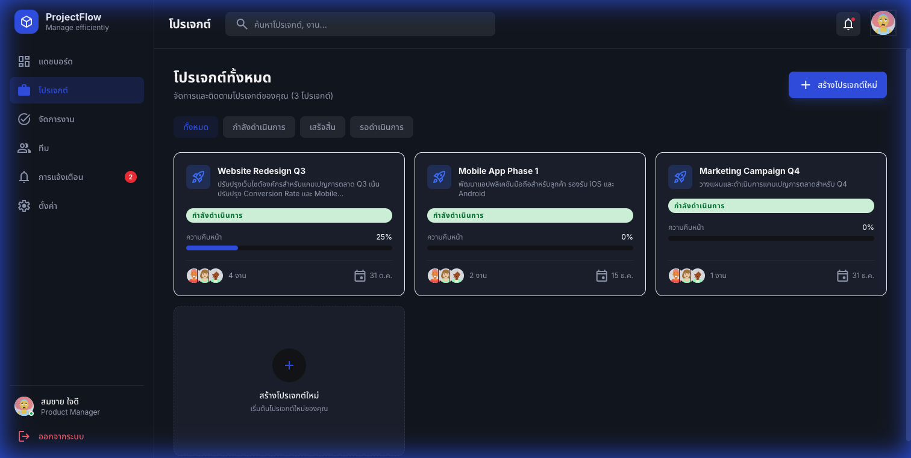

# ProjectFlow - ระบบจัดการบริหารโปรเจกต์สำหรับทีม

<div align="center">


**ระบบจัดการโปรเจกต์สำหรับทีม พัฒนาด้วย Vite + React + TypeScript + Supabase**

[](https://vitejs.dev/)
[](https://reactjs.org/)
[](https://www.typescriptlang.org/)
[](https://tailwindcss.com/)
[](https://supabase.com/)

</div>

---

## 📸 Screenshots

### หน้า Login


### หน้า Dashboard


### หน้าโปรเจกต์


---

## ✨ Features

### 🔐 Authentication
- เข้าสู่ระบบด้วย Email/Password
- สมัครสมาชิกใหม่
- Demo Mode (ใช้งานได้โดยไม่ต้องเชื่อมต่อ Supabase)
- Protected Routes

### 📊 Dashboard
- ข้อความต้อนรับพร้อมชื่อผู้ใช้
- Stats Cards (โปรเจกต์ที่กำลังทำ, งานที่ครบกำหนด, อัตราการเสร็จสิ้น)
- รายการโปรเจกต์พร้อม Progress Bar
- รายการงานของฉัน

### 📁 Project Management
- รายการโปรเจกต์พร้อมตัวกรอง
- หน้ารายละเอียดโปรเจกต์พร้อม Tabs
- รายการงานในโปรเจกต์
- สร้างโปรเจกต์ใหม่
- เลือกสมาชิกทีม

### ✅ Task Management
- Kanban Board View
- 4 คอลัมน์: รอดำเนินการ, กำลังทำ, ตรวจสอบ, เสร็จสิ้น
- Task Cards พร้อมข้อมูลผู้รับผิดชอบ, กำหนดส่ง, ความสำคัญ
- กรองงานตามผู้ใช้หรือวันครบกำหนด

### 👥 Team
- ตารางสมาชิกทีม
- ค้นหาและกรอง
- สถานะออนไลน์ (Online, Away, Busy, Offline)
- แถบภาระงาน

### 🔔 Notifications
- รายการแจ้งเตือนแบ่งตามวัน (วันนี้, เมื่อวาน)
- ประเภทการแจ้งเตือน (มอบหมายงาน, คอมเมนต์, เปลี่ยนสถานะ)
- Mark as read
- แสดงจำนวนที่ยังไม่อ่าน

### ⚙️ Settings
- แก้ไขโปรไฟล์
- แสดง Avatar
- เปิด/ปิดการแจ้งเตือน
- เปลี่ยนรหัสผ่าน
- ลบบัญชี

---

## 🛠️ Tech Stack

| Layer | Technology |
|-------|------------|
| Framework | Vite + React 18 |
| Language | TypeScript |
| Styling | Tailwind CSS v4 |
| Icons | Material Symbols |
| State Management | Zustand |
| Routing | React Router v6 |
| Backend | Supabase (optional) |

---

## 📦 Installation

### Prerequisites
- Node.js 18+
- npm หรือ yarn

### ขั้นตอนการติดตั้ง

```bash
# Clone repository
git clone https://github.com/your-username/projectflow.git
cd projectflow

# ติดตั้ง dependencies
npm install

# รัน development server
npm run dev
```

แอปจะรันที่ http://localhost:5173 (หรือ port ถัดไปที่ว่าง)

---

## 🎮 Demo Mode

แอปมี Demo Mode ที่ใช้งานได้โดยไม่ต้องเชื่อมต่อ Supabase:

1. เข้า http://localhost:5173
2. กรอก email และ password อะไรก็ได้
3. คลิก "เข้าสู่ระบบ"
4. เริ่มใช้งาน!

ข้อมูลทั้งหมดจะเป็นข้อมูลตัวอย่างภาษาไทย

---

## 🔗 เชื่อมต่อ Supabase

สำหรับการใช้งานจริงพร้อมฐานข้อมูล:

### 1. สร้าง Environment File

```bash
cp .env.example .env
```

### 2. เพิ่ม Supabase Credentials

แก้ไขไฟล์ `.env`:

```env
VITE_SUPABASE_URL=https://your-project.supabase.co
VITE_SUPABASE_ANON_KEY=your-anon-key
```

### 3. สร้างตารางใน Supabase

รัน SQL ต่อไปนี้ใน Supabase SQL Editor:

```sql
-- Users profile extension
CREATE TABLE profiles (
  id UUID REFERENCES auth.users PRIMARY KEY,
  full_name TEXT,
  avatar_url TEXT,
  job_title TEXT,
  bio TEXT,
  created_at TIMESTAMPTZ DEFAULT NOW(),
  updated_at TIMESTAMPTZ DEFAULT NOW()
);

-- Projects
CREATE TABLE projects (
  id UUID PRIMARY KEY DEFAULT gen_random_uuid(),
  name TEXT NOT NULL,
  description TEXT,
  status TEXT DEFAULT 'active',
  start_date DATE,
  end_date DATE,
  created_by UUID REFERENCES profiles(id),
  created_at TIMESTAMPTZ DEFAULT NOW(),
  updated_at TIMESTAMPTZ DEFAULT NOW()
);

-- Tasks
CREATE TABLE tasks (
  id UUID PRIMARY KEY DEFAULT gen_random_uuid(),
  project_id UUID REFERENCES projects(id) ON DELETE CASCADE,
  title TEXT NOT NULL,
  description TEXT,
  status TEXT DEFAULT 'todo',
  priority TEXT DEFAULT 'medium',
  due_date DATE,
  assignee_id UUID REFERENCES profiles(id),
  created_by UUID REFERENCES profiles(id),
  created_at TIMESTAMPTZ DEFAULT NOW(),
  updated_at TIMESTAMPTZ DEFAULT NOW()
);

-- Notifications
CREATE TABLE notifications (
  id UUID PRIMARY KEY DEFAULT gen_random_uuid(),
  user_id UUID REFERENCES profiles(id) ON DELETE CASCADE,
  type TEXT NOT NULL,
  title TEXT NOT NULL,
  content TEXT,
  is_read BOOLEAN DEFAULT FALSE,
  created_at TIMESTAMPTZ DEFAULT NOW()
);
```

---

## 📁 Project Structure

```
projectflow/
├── index.html              # Entry HTML with fonts
├── vite.config.ts          # Vite + Tailwind configuration
├── tsconfig.app.json       # TypeScript with path aliases
├── .env.example            # Environment variables template
└── src/
    ├── main.tsx            # App entry point
    ├── App.tsx             # Router configuration
    ├── index.css           # Global styles + Tailwind
    ├── lib/
    │   ├── supabase.ts     # Supabase client
    │   └── database.types.ts  # TypeScript types
    ├── contexts/
    │   └── AuthContext.tsx # Authentication state
    ├── store/
    │   └── appStore.ts     # Zustand store with demo data
    ├── components/
    │   ├── layout/
    │   │   ├── Sidebar.tsx
    │   │   ├── Header.tsx
    │   │   └── Layout.tsx
    │   └── ui/
    │       ├── Button.tsx
    │       ├── Input.tsx
    │       ├── Card.tsx
    │       ├── Avatar.tsx
    │       └── Badge.tsx
    └── pages/
        ├── LoginPage.tsx
        ├── RegisterPage.tsx
        ├── DashboardPage.tsx
        ├── ProjectsPage.tsx
        ├── ProjectDetailPage.tsx
        ├── TasksPage.tsx
        ├── TeamPage.tsx
        ├── NotificationsPage.tsx
        ├── SettingsPage.tsx
        └── CreateProjectPage.tsx
```

---

## 🚀 Scripts

```bash
# Development server
npm run dev

# Build for production
npm run build

# Preview production build
npm run preview

# Type checking
npm run typecheck

# Linting
npm run lint
```

---

## 🎨 Design System

### Colors
- **Primary**: `#135bec` (Blue)
- **Background Dark**: `#101622`
- **Surface Dark**: `#1c1f27`
- **Text Primary**: `#ffffff`
- **Text Secondary**: `#9da6b9`

### Fonts
- **Primary**: Inter
- **Thai**: Noto Sans Thai

### Icons
- Material Symbols Outlined

---

## 📝 License

MIT License - ดู [LICENSE](LICENSE) สำหรับรายละเอียด

---

## 🙏 Acknowledgments

- Design mockups สร้างโดยใช้ Tailwind CSS
- Icons จาก [Google Material Symbols](https://fonts.google.com/icons)
- Avatars จาก [DiceBear](https://dicebear.com/)

---

<div align="center">

**Made with ❤️ by ProjectFlow Team**

</div>
